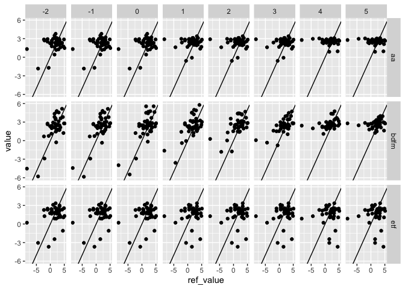

Evaluating GDP Forecasts
================
christoph
2019-07-20

``` r
library(timemachine)
library(forecast)
library(tidyverse)
library(tsbox)
library(bdfm)


# Benchmark Data ---------------------------------------------------------------

bench_data <-
  econ_us %>%
  ts_tbl()  %>%
  filter(!is.na(value)) %>%
  ts_pick("A191RL1Q225SBEA") %>%
  select(ref_date = time, ref_value = value)

results <- as_tibble(data.table::fread("timemachine_results.csv")) %>%
  mutate_at(vars(pub_date, ref_date), as.Date)


# Errors -----------------------------------------------------------------------

yearmonth <- function(x) {
  data.table::year(x) * 12 + data.table::month(x)
}

errors <-
  results %>%
  left_join(bench_data, by = "ref_date") %>%
  # add fct horizon
  group_by(pub_date, expr) %>%
  mutate(h = yearmonth(ref_date) - yearmonth(pub_date)) %>%
  ungroup() %>%
  filter(h >= -2, h <= 5) %>%
  mutate(error = value - ref_value) %>%
  filter(!is.na(error))

# RMSE -------------------------------------------------------------------------

errors %>%
  group_by(h, expr) %>%
  summarize(rsme = sqrt(sum(error^2))) %>%
  ungroup() %>%
  spread(key = expr, value = rsme) %>%
  knitr::kable()
```

|   h |       aa |     bdfm |      etf |
| --: | -------: | -------: | -------: |
| \-2 | 16.31396 | 12.19481 | 16.48785 |
| \-1 | 16.31490 | 12.07675 | 16.49446 |
|   0 | 16.31257 | 12.63509 | 16.49114 |
|   1 | 17.77690 | 13.63132 | 18.33303 |
|   2 | 17.77690 | 14.28300 | 18.33303 |
|   3 | 16.97743 | 13.36043 | 17.77994 |
|   4 | 17.70423 | 16.23169 | 18.93395 |
|   5 | 17.70423 | 16.99819 | 18.93395 |

``` r
# Graphs -----------------------------------------------------------------------

errors %>%
  ggplot(aes(x = ref_value, y = value)) +
  geom_point() +
  geom_abline(slope = 1) +
  facet_grid(rows = vars(expr), cols = vars(h))
```

<!-- -->
